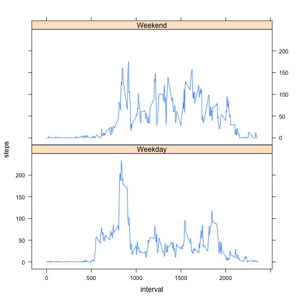

# Reproducible Research: Peer Assessment 1


## Loading and preprocessing the data


```r
table <- read.csv("activity.csv")
tablenona <- table[complete.cases(table),]
daytable <- aggregate(steps ~ date, tablenona, sum)
timetablemean <- aggregate(steps ~ interval, tablenona, mean)
```


## What is mean total number of steps taken per day?


```r
meanst = mean(daytable$steps)
medianst = median(daytable$steps)
hist(daytable$steps, breaks = 20, xlab="Steps", ylab="Days", main="Number of steps")
```

 

The mean is 10766 and the median is 10765.

## What is the average daily activity pattern?


```r
maxmeansteps <- timetablemean[which.max(timetablemean$steps),]
plot(timetablemean, type="l", main="Average daily activity pattern")
```

 

The maximum average of steps (206.1698 steps) is contained in 835th interval

## Imputing missing values


```r
tablenas <- table[!complete.cases(table),]
tablenascount <- length(tablenas[,1])
nonatable <- table
nonatable$steps[is.na(nonatable$steps)] <- round(timetablemean$steps[is.na(table$steps)])
nonadaytable <- aggregate(steps ~ date, nonatable, sum)
hist(nonadaytable$steps, breaks = 20, xlab="Steps", ylab="Days", main="Number of steps (table with no NAs)")
```

 

```r
nonameanst = mean(daytable$steps)
nonamedianst = median(daytable$steps)
```

Total number of rows with NAs in the original table: 2304

The mean is 10766 and the median is 10765.


## Are there differences in activity patterns between weekdays and weekends?


```r
library(lattice)
wdtable <- nonatable
wdtable$weekday <- factor(ifelse((weekdays(as.Date(wdtable$date))=="Sunday") | (weekdays(as.Date(wdtable$date))=="Saturday"), "Weekend", "Weekday"))
wdtable <- aggregate(steps ~ interval + weekday, wdtable, mean)
xyplot(steps ~ interval | weekday, type="l", layout=c(1,2), data=wdtable)
```

 
